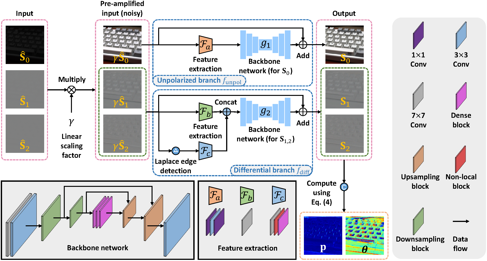

# Polarization-Aware Low-Light Image Enhancement

By [Chu Zhou](https://fourson.github.io/), Minggui Teng, Youwei Lyu, Si Li, Chao Xu, [Boxin Shi](http://ci.idm.pku.edu.cn/)


[PDF]() | [SUPP]()

## Abstract
Polarization-based vision algorithms have found uses in various applications since polarization provides additional physical constraints. However, in low-light conditions, their performance would be severely degenerated since the captured polarized images could be noisy, leading to noticeable degradation in the degree of polarization (DoP) and the angle of polarization (AoP). Existing low-light image enhancement methods cannot handle the polarized images well since they operate in the intensity domain, without effectively exploiting the information provided by polarization. In this paper, we propose a Stokes-domain enhancement pipeline along with a dual-branch neural network to handle the problem in a polarization-aware manner. Two application scenarios (reflection removal and shape from polarization) are presented to show how our enhancement can improve their results.

## Prerequisites
* Linux Distributions (tested on Ubuntu 20.04).
* NVIDIA GPU and CUDA cuDNN
* Python >= 3.7
* Pytorch >= 1.10.0
* cv2
* numpy
* tqdm
* tensorboardX (for training visualization)

## Pre-trained models
* We provide the [pre-trained models](https://drive.google.com/drive/folders/1tL9wUvz-ZBOfnQeVfFycty8L3PG9tiKT?usp=sharing) for inference
* Please put the downloaded files (`Ours.pth` and `Ours_gray.pth`) into the `checkpoint` folder

## Inference
* RGB images:
```
python execute/infer_subnetwork2.py -r checkpoint/Ours.pth --data_dir <path_to_input_data> --result_dir <path_to_result_data> --data_loader_type InferDataLoader --verbose_output 1 default
```
* Grayscale images (converted from the RGB images):
```
python execute/infer_subnetwork2.py -r checkpoint/Ours_gray.pth --data_dir <path_to_input_data> --result_dir <path_to_result_data> --data_loader_type GrayInferDataLoader --verbose_output 1 gray
```
* Real grayscale images captured by a polarization camera (used for applications):
```
python execute/infer_subnetwork2.py -r checkpoint/Ours_gray.pth --data_dir <path_to_input_data> --result_dir <path_to_result_data> --data_loader_type RealGrayInferDataLoader --verbose_output 1 gray
```

## Visualization
Since the file format we use is `.npy`, we provide scrips for visualization:
* use `notebooks/visualize_aop.py` to visualize the AoP
* use `notebooks/visualize_dop.py` to visualize the DoP
* use `notebooks/visualize_S0.py` to visualize S0
* use `notebooks/visualize_S1_S2.py` to visualize S1 or S2

## How to use our PLIE dataset
* We provide the [raw images](https://drive.google.com/drive/folders/1pKASjA0fQEIRwJVCGMokt3g_jOpcqOru?usp=sharing) captured by a Lucid Vision Phoenix polarization camera, including two folders:
  * `for_train`: containing the raw images used for training
  * `for_test`: containing the raw images used for testing
* Please put the downloaded folders (`for_train` and `for_test`) into the `raw_images` folder
* After downloading, you can use our scripts to preprocess them for obtaining the dataset:
  * For obtaining the dataset for testing:
    1. run `scripts/preprocess_dataset.py` after setting the `in_dir` and `out_base_dir` parameters in it to `'../raw_images/for_test'` and `'../raw_images/data_test_temp'` respectively
    2. run `scripts/make_dataset_test.py`
    3. now you can find the dataset for testing in `data/test`
  * For obtaining the dataset for training:
    1. run `scripts/preprocess_dataset.py` after setting the `in_dir` and `out_base_dir` parameters in it to `'../raw_images/for_train'` and `'../raw_images/data_train_temp'` respectively
    2. run `scripts/make_dataset_train.py`
    3. now you can find the dataset for training in `data/train`
  
## Training your own model
* RGB:
```
python execute/train.py -c config/subnetwork2.json
```
* Grayscale:
```
python execute/train.py -c config/subnetwork2_gray.json
```
Note that all config files (`config/*.json`) and the learning rate schedule function (MultiplicativeLR) at `get_lr_lambda` in `utils/util.py` could be edited

## Citation
If you find this work helpful to your research, please cite:
```
coming soon
```
